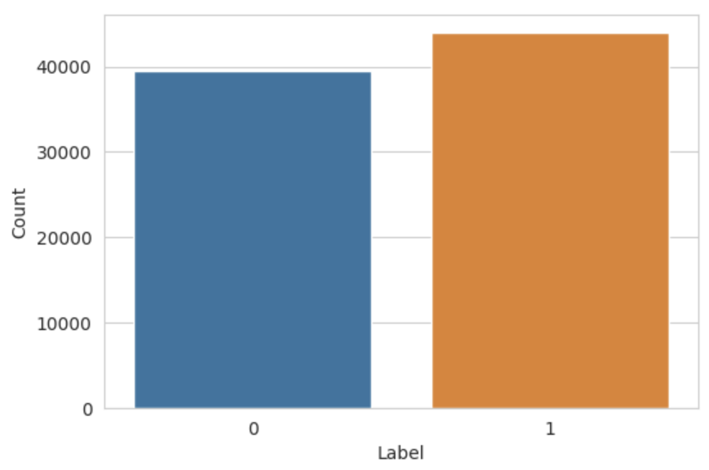
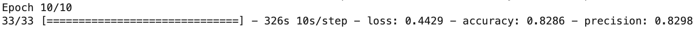
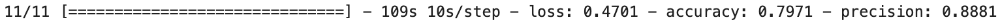

# Spam Email Classification Model

## Introduction

There are two objectives for this project:
  - Create and train a machine learning model that can predict if an email is spam or not.
  - Learn about text classifcation and functional models.

Google's BERT transformer was used. BERT takes a string and produces a context-aware vector that is processed in the functional neural network, ultimately leading to a prediction.

The model was developed and trained in a Colab notebook which is available [here](https://github.com/mLucas55/spam-email-classification/blob/main/code/spam-email-classification.ipynb).

## Selection of Data

The data set can be found online [here](https://drive.google.com/file/d/1ElqSIk-nJp8yKlz9ZGyVoKQ7e4OE1mpB/view?usp=sharing).

The data set has 83,488 total sample emails with a binary classificaiton colum.
  - 0 = not spam
  - 1 = spam
  - 43910 spam
  - 39538 not spam

Data Preview:

Label Distrubtion:

The data set is a combination of two other email data sets. Along with combining data sets, the creater also preprocessed all data by removing HTML elements, subjects, and actual email addresses.

However there seemed to be an artifact in the data as a result of the preprocessing: The string 'escapenumber' occured multiple times in essentially all emails. I used str.replace() to replace 'escapenumber' with an empty string. This caused a slight rise in the models accuracy of ~3%.

## Methods

Tools:
  - TensorFlow: Machine learning library used for model creation
  - BERT: Text transformer
  - Sklearn: Machline learning library used for creating test and train sets
  - Pandas: Data manipulation 
  - Seaborn + Matplotlib: Data visualization
  - Colab: Development notebook
  - GitHub: Version control

Setup Steps:

1. Import csv file into a DataFrame using pandas.
2. Observe data's cleanliness and balance.
    - Found invalid strings -> replaced them with empty strings (covered in "Selection of Data" section).
    - Data had slightly more spam than non spam so I downsampled the data and created a new balanced DataFrame.
3. Split balanced data into training and testing sets.
    - Stratify = true -> maintain proportion of label distribution in train and test data.

Model Creation Steps:

1. Create a keras input layer that takes an email as an input.
2. Use bert_preprocesser to tokenize text.
3. use bert_encoder to create a context aware vector that represents the meaning of words in the context of a sentance.
4. Create a keras dropout layer (.1) on the output of bert_encoder to reduce overfitting.
5. Create a keras dense layer as the output layer using a sigmoid activation function for binary classification.

Model Training: 

1. Trained the model with various sample sizes, batch sizes, dropout %, epochs, etc.
2. The model went down in accuracy when provided with larger sample sizes.
     - Increasing dropout didn't solve this which means it might not have been overfitting.
     - This could be due to low quality data -> maybe try training with a different data set.

Training Results:

## Results

Evaluation Results:

The model is ~80% accurate and 88% precise on unseen data. Overall: | - Loss | - Accuracy | + Precission |
  - High precision percantage reveals the model is conservative in labeling emails as spam (fewer false positives).
  - When comparing the evaluatation accuracy to training accuracy there is a -.0315∆ or -3.1%∆. This shows the model could struggle with generalizing.
    - Increase in loss % during evaluation supports this claim.
