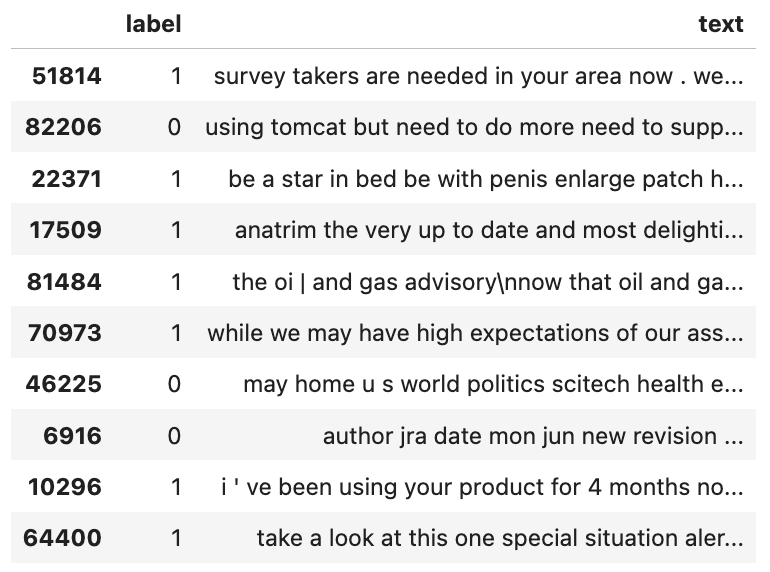

# Spam Email Classification Model

## Introduction

There are two objectives for this project:
  - Create and train a machine learning model that can predict if an email is spam or not.
  - Learn about text classifcation and functional models

Google's BERT transformer was used. BERT takes a string and produces a context-aware vector that I then processed in the functional neural network, ultimately leading to a prediction.

## Selection of Data

The model was developed and trained in a Colab notebook which is available [here](https://github.com/mLucas55/spam-email-classification/blob/main/code/spam-email-classification.ipynb).

The data set has 83,488 total sample emails with a binary classificaiton colum
  - 0 = not spam
  - 1 = spam
  - 43910 spam
  - 39538 not spam
The data set can be found online [here](https://drive.google.com/file/d/1ElqSIk-nJp8yKlz9ZGyVoKQ7e4OE1mpB/view?usp=sharing)

Data Preview:

